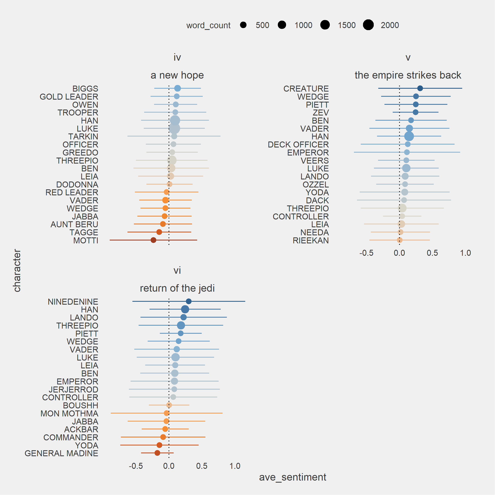
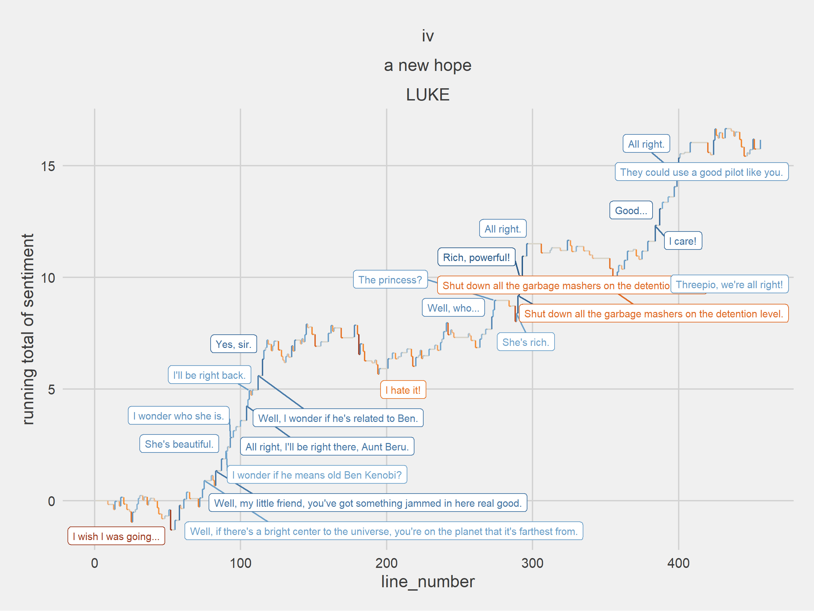
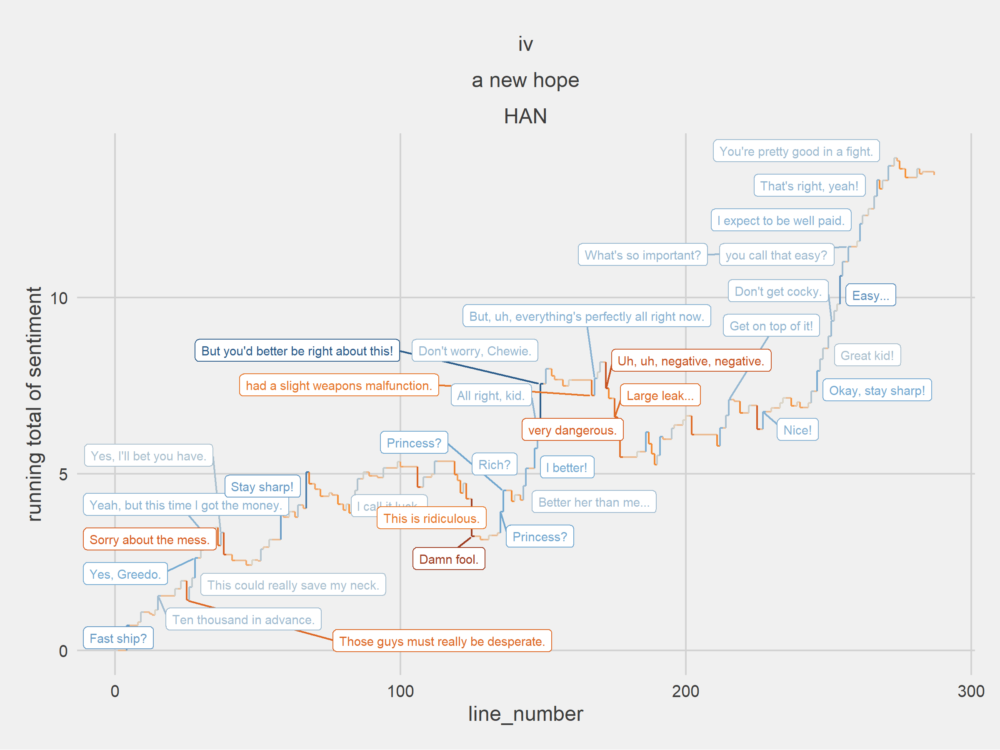
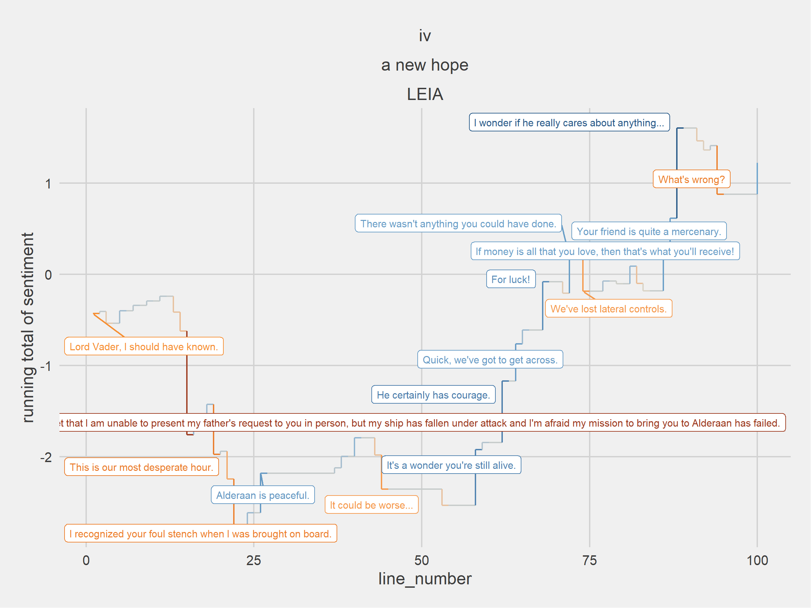

# Sentiment analysis for Star Wars

## data

Load packages, functions, and data for analyzing sentiment in the
scripts of the original Star Wars trilogy

``` r
# load packages
library(tidyverse)
library(tidytext)
library(ggthemes)
library(textdata)
library(sentimentr)
library(ggrepel)
library(ggforce)
library(plotly)

# load and set ggplot theme
source("src/functions.R")

theme_set(
        theme_phil()+
                theme(
                        strip.text.x = element_text(size = 12)
                )
)

# tokenize and remove stopwords
load_stopwords()

# read in starwars text
starwars =
        load_data() |>
        clean_data()
```

## sentiment

Calculate sentiment via **sentimentr**.

``` r
# use sentimentr
starwars_sentiment = 
        starwars |>
        get_sentences()  |>
        add_sentiment()
```

# sentiment by dialogue

what pieces of dialogue in star wars have the highest average
positive/negative sentiment?

## positive

``` r
starwars_sentiment |>
        group_by(document, index = line_number %/% 4) |>
        summarize(sentiment = mean(sentiment),
                  characters = paste(unique(character), collapse = '\n'),
                  dialogue = paste(dialogue, collapse = '\n'),
                  .groups = 'drop') |>
        select(document, characters, dialogue, sentiment) |>
        slice_max(sentiment, n = 10) |>
        mutate_if(is.numeric, round, 2) |>
        gt::gt() |>
        gt::as_raw_html()
```

<div>

<div id="pftkwjjzne" style="padding-left:0px;padding-right:0px;padding-top:10px;padding-bottom:10px;overflow-x:auto;overflow-y:auto;width:auto;height:auto;">
  &#10;  

| document                | characters                              | dialogue                                                                                                                                                                                                                                                      | sentiment |
|:------------------------|:----------------------------------------|:--------------------------------------------------------------------------------------------------------------------------------------------------------------------------------------------------------------------------------------------------------------|----------:|
| return of the jedi      | LUKE THREEPIO BIB                       | You serve your master well. And you will be rewarded. At last! Master Luke's come to rescue me. Master.                                                                                                                                                       |      0.51 |
| a new hope              | LUKE HAN                                | You will... All right, kid. But you'd better be right about this! All right. What's your plan?                                                                                                                                                                |      0.48 |
| a new hope              | LUKE HAN                                | She's rich. Rich? Yes. Rich, powerful! Listen, if you were to rescue her, the reward would be... What?                                                                                                                                                        |      0.42 |
| return of the jedi      | THREEPIO NINEDENINE                     | Oh. Well, yes. How many languages do you speak? I am fluent in over six million forms of communication, and can readily... Splendid! We have been without an interpreter since our master got angry with our last protocol droid and disintegrated him.       |      0.39 |
| return of the jedi      | HAN LEIA                                | Back door, huh? Good idea. It's only a few guards. This shouldn't be too much trouble. Well, it only takes one to sound the alarm. Then we'll do it real quiet-like.                                                                                          |      0.38 |
| the empire strikes back | LANDO THREEPIO LEIA                     | How you doing, you old pirate? So good to see you! I never thought I'd catch up with you again. Where you been? Well, he seems very friendly. Yes... very friendly. What are you doing here?                                                                  |      0.38 |
| the empire strikes back | LANDO LUKE                              | Luke, we're ready for takeoff. Good luck, Lando When we find Jabba the Hut and that bounty hunter, we'll contact you. I'll meet you at the rendezvous point on Tatooine.                                                                                      |      0.37 |
| a new hope              | LUKE HAN                                | Well more wealth that you can imagine. I don't know, I can imagine quite a bit! You'll get it! I better!                                                                                                                                                      |      0.36 |
| return of the jedi      | THREEPIO LUKE HAN                       | Oh, my head. Oh, my goodness! Do you understand anything they're saying? Oh, yes, Master Luke! Remember that I am fluent in over six million forms of communication. What are you telling them?                                                               |      0.34 |
| the empire strikes back | SECOND CONTROLLER PIETT VADER BOBA FETT | Sir, we have a priority signal from the Star Destroyer Avenger. Right. ... there will be a substantial reward for the one who finds the Millennium Falcon. You are free to use any methods necessary, but I want them alive. No disintegrations. As you wish. |      0.33 |

</div>

</div>

## negative

``` r
starwars_sentiment |>
        group_by(document, index = line_number %/% 4) |>
        summarize(sentiment = mean(sentiment),
                  characters = paste(unique(character), collapse = '\n'),
                  dialogue = paste(dialogue, collapse = '\n'),
                  .groups = 'drop') |>
        select(document, characters, dialogue, sentiment) |>
        slice_min(sentiment, n = 10) |>
        mutate_if(is.numeric, round, 2) |>
        gt::gt() |>
        gt::as_raw_html()
```

<div>

<div id="xtgdgsupsd" style="padding-left:0px;padding-right:0px;padding-top:10px;padding-bottom:10px;overflow-x:auto;overflow-y:auto;width:auto;height:auto;">
  &#10;  

| document                | characters                  | dialogue                                                                                                                                                                                                                                                                                                                                                                                                                                                                                                                                                                                                                                   | sentiment |
|:------------------------|:----------------------------|:-------------------------------------------------------------------------------------------------------------------------------------------------------------------------------------------------------------------------------------------------------------------------------------------------------------------------------------------------------------------------------------------------------------------------------------------------------------------------------------------------------------------------------------------------------------------------------------------------------------------------------------------|----------:|
| the empire strikes back | HAN LEIA                    | Stop what? Stop that! My hands are dirty. My hands are dirty, too. What are you afraid of? Afraid?                                                                                                                                                                                                                                                                                                                                                                                                                                                                                                                                         |     -0.39 |
| a new hope              | THREEPIO                    | Did you hear that? They've shut down the main reactor. We'll be destroyed for sure. This is madness! We're doomed! There'll be no escape for the Princess this time.                                                                                                                                                                                                                                                                                                                                                                                                                                                                       |     -0.37 |
| a new hope              | RED LEADER RED NINE'S VOICE | It's away! It's a hit! Negative. Negative! It didn't go in, it just impacted on the surface.                                                                                                                                                                                                                                                                                                                                                                                                                                                                                                                                               |     -0.33 |
| a new hope              | RED LEADER RED TEN          | This is it! We should be able to see it by now. Keep your eyes open for those fighters! There's too much interference!                                                                                                                                                                                                                                                                                                                                                                                                                                                                                                                     |     -0.31 |
| a new hope              | TROOPER HAN THREEPIO        | Stop that ship! Blast 'em! Chewie, get us out of here! Oh, my. I'd forgotten how much I hate space travel.                                                                                                                                                                                                                                                                                                                                                                                                                                                                                                                                 |     -0.26 |
| a new hope              | MOTTI VADER                 | Any attack made by the Rebels against this station would be a useless gesture, no matter what technical data they've obtained. This station is now the ultimate power in the universe. I suggest we use it! Don't be too proud of this technological terror you've constructed. The ability to destroy a planet is insignificant next to the power of the Force. Don't try to frighten us with your sorcerer's ways, Lord Vader. Your sad devotion to that ancient religion has not helped you conjure up the stolen data tapes, or given you clairvoyance enough to find the Rebel's hidden fort... I find your lack of faith disturbing. |     -0.25 |
| a new hope              | LUKE THREEPIO               | Threepio! We've had some problems... Shut down all the garbage mashers on the detention level, will you? Do you copy? Shut down all the garbage mashers on the detention level.                                                                                                                                                                                                                                                                                                                                                                                                                                                            |     -0.24 |
| a new hope              | BEN LUKE                    | That's what your uncle told you. He didn't hold with your father's ideals. Thought he should have stayed here and not gotten involved. You fought in the Clone Wars? Yes, I was once a Jedi Knight the same as your father. I wish I'd known him.                                                                                                                                                                                                                                                                                                                                                                                          |     -0.24 |
| the empire strikes back | THREEPIO LEIA HAN           | We're doomed! The cave is collapsing. This is no cave. What?                                                                                                                                                                                                                                                                                                                                                                                                                                                                                                                                                                               |     -0.24 |
| a new hope              | HAN BEN TROOPER HAN'S VOICE | Damn fool. I knew that you were going to say that! Who's the more foolish... the fool or the fool who follows him? The ship's all yours. If the scanners pick up anything, report it immediately. All right, let's go. Hey down there, could you give us a hand with this?                                                                                                                                                                                                                                                                                                                                                                 |     -0.23 |

</div>

</div>

# sentiment by character

Plot average sentiment across main speaking roles in the original
trilogy.

``` r
starwars |>
        plot_avg_sentiment(
                top_n = 20,
                scales = "free_y"
        )
```



# sentiment by line

Plot running sentiment for a character across the script.

``` r
# plot sentiment for all characters
starwars_sentiment |>
        filter(document == 'a new hope') |>
        filter(character == 'LUKE') |>
        plot_character_lines_with_sentiment()
```



``` r
# plot sentiment for all characters
starwars_sentiment |>
        filter(document == 'a new hope') |>
        filter(character == 'HAN') |>
        plot_character_lines_with_sentiment()
```



``` r
# plot sentiment for all characters
starwars_sentiment |>
        filter(document == 'a new hope') |>
        filter(character == 'LEIA') |>
        plot_character_lines_with_sentiment()
```


